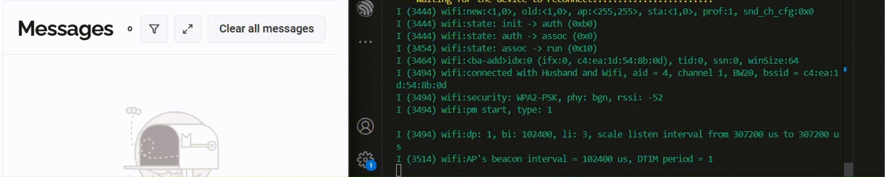

# Hot-Seat: Secure ESP32 MQTT Client Example

**Hot-Seat** is a secure MQTT client example for ESP32, demonstrating best practices for connecting to a cloud MQTT broker over SSL/TLS. The project is designed for modularity, security, and ease of configuration, making it a strong foundation for IoT applications.

Key features:

* Secure MQTT (MQTTS) communication using the ESP-MQTT library
* Certificate-based authentication with embedded PEM files



## How to use example

### Hardware Required

* Any ESP32-based development board with WiFi capability
* USB cable for flashing and monitoring

### Configure the project

* Open the project configuration menu (`idf.py menuconfig`)
* Configure Wi-Fi and MQTT Server settings under "Example Configuration" menu

PEM certificate for this example could be extracted from an openssl `s_client` command connecting to hivemq.cloud.
In case a host operating system has `openssl` and `sed` packages installed, one could execute the following command to download and save the root certificate to a file.
```
echo "" | openssl s_client -showcerts -connect hivemq.cloud:8883 | sed -n "1,/Root/d; /BEGIN/,/END/p" | openssl x509 -outform PEM >broker_certificate.pem
```

### Build and Flash

Build the project and flash it to the board, then run monitor tool to view serial output:

```
idf.py -p PORT flash monitor
```

## To Do

- [x] Create initial **Hot-Seat** project and share it :tada:
- [ ] Write Unit Tests
- [ ] Integrate real Temperature & Humidity sensor
